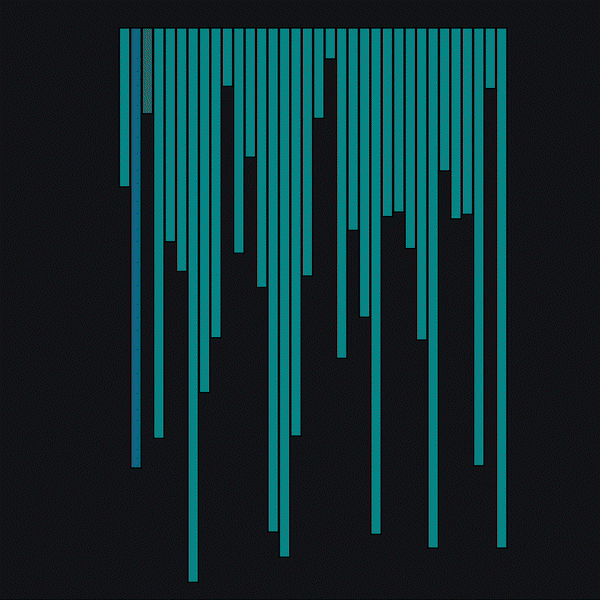
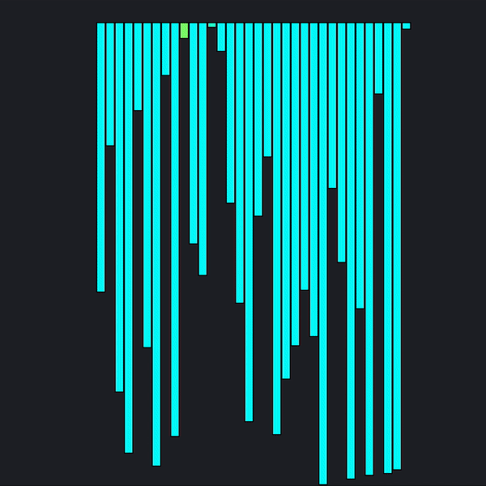
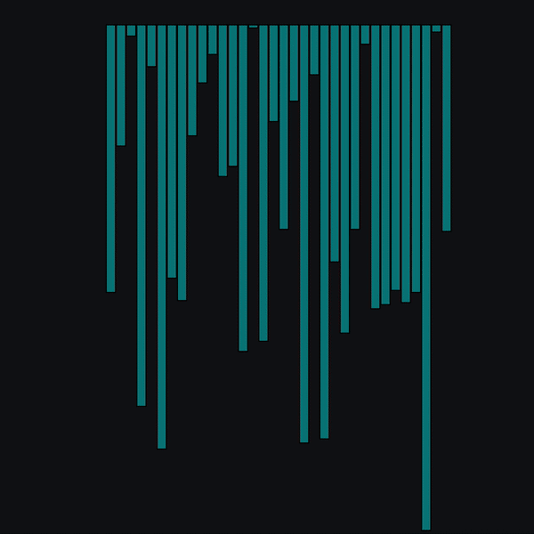
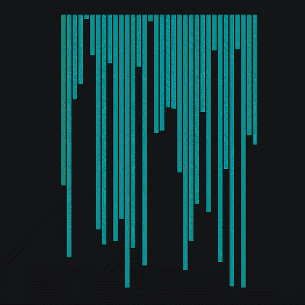
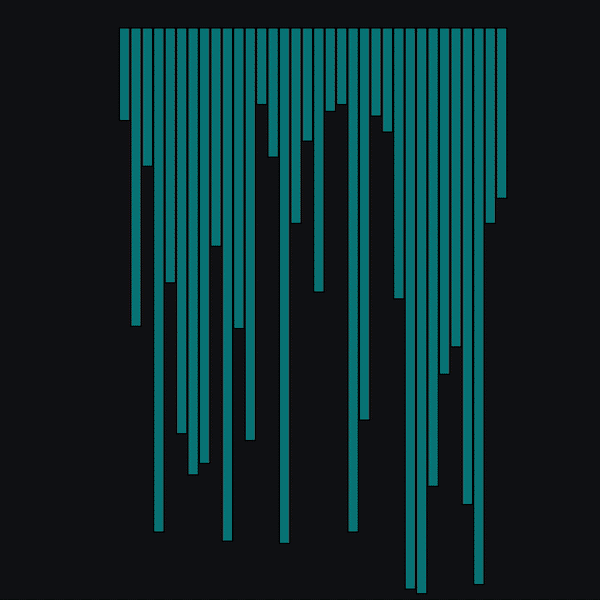

<h1 align="center">Array Sorting Visualizer</h1> 
<h3 align="center">⭐ Make sure to give this repository a star! ⭐</h3>

## ❓ About

An Array-Sorting visualizer using JavaScript which gives a visual representation of how different sorting techniques work.

## 🔗 Live site: [Array Sorting Visualiser](https://shailendra1703.github.io/Array-Sorting-Visualizer/)

## ✅ How to Contribute?

### Follow these steps:

- Create or find an unassigned issue.
- Fork and clone this repo.
- Create a branch with your name.
- Add your code.
- Create a pull request.

<h2 align="center">Algorithms</h2>
<table bordercolor="#66b2b2">
    <tr>
        <td width="50%">
        <h3 align="center">Bubble Sort</h3>
        

            This algorithm will iterate over the array and repeatedly compare adjacent elements, swapping them if they are not in the correct order.
        

             
                
             
        </td>
        <td width="50%">
                <h3 align="center">Selection Sort</h3>
        

            This algorithm will iterate over the array, finding the minimum element from the unsorted portion, and swap it in place with the first element of unsorted portion.
        

             
                
             
        </td>
    </tr>
        <tr>
        <td width="50%">
                <h3 align="center">Insertion Sort</h3>
        

            This algorithm splits the array into sorted and unsorted parts, picking elements from the unsorted portion and placing them in the correct position of the sorted portion.
        

             
                
             
        </td>
        <td width="50%">
                <h3 align="center">Merge Sort</h3>
        

         This algorithm recursively splits the array in half until it cannot be further divided. It will then begin merging from the smallest units based on the comparison of the two, and continue until you have a final sorted array.
        

             
                
             
        </td>
    </tr>
        <tr>
        <td width="50%">
                <h3 align="center">Quick Sort</h3>
        

            This algorithm picks a pivot element and partitions the array around the pivot. The partition will put all array elements greater than the pivot to the right, and lesser than to the left. This is called recursively to produce the sorted array.
        

             
                
             
        </td>
        <td width="50%" valign="top">
        <h3 align="center">Performance</h3>
        

            When choosing a sorting algorithm, you must consider the limitations and requirements. 
             
            Establishing key factors such as the size of your dataset and how much memory is available to run the sort will help you determine which sort is best for you.
             
             
            Algorithms such as Bubble sort are slow, and not suitable for large collections, whilst Merge sort is resource intensive.
             
             
            Check out the performance of each sort in the visualiser to help you decide.
        

        </td>
    </tr>
</table>
